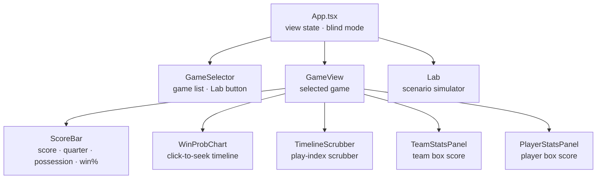
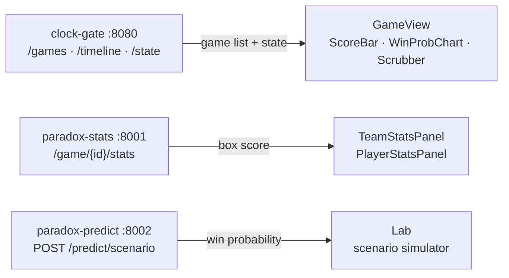

# paradox-ui

React + TypeScript frontend for the ParadoxSportsData platform. Displays NFL game state at any elapsed second via an interactive timeline scrubber — score, down-and-distance, win probability, team and player stats, and a win-probability scenario Lab.

**Port:** 5173 (dev) / 4173 (preview)  
**Repo:** [ParadoxSportsData/paradox-ui](https://github.com/ParadoxSportsData/paradox-ui)

---

## Backend services

| Service | Port | Required for |
|---------|------|-------------|
| [paradox-clock-gate](https://github.com/ParadoxSportsData/paradox-clock-gate) | 8080 | Game list, timeline scrubber, score and game state — core functionality |
| [paradox-stats](https://github.com/ParadoxSportsData/paradox-stats) | 8001 | Team and player stats panels (panels show empty without it) |
| [paradox-predict](https://github.com/ParadoxSportsData/paradox-predict) | 8002 | Win-probability Lab (Lab tab shows unavailable without it) |

---

## Architecture

### Component hierarchy



### Backend data flow



---

## Prerequisites

- Node.js 20+ (`node --version` to check)

---

## Quick start

```bash
git clone https://github.com/ParadoxSportsData/paradox-ui
cd paradox-ui
npm install
npm run dev
```

Open [http://localhost:5173](http://localhost:5173).

---

## Running against the live backend

Start all backend services first (each in its own terminal):

```bash
# 1. paradox-clock-gate (port 8080) — requires paradox-platform data next to this repo
cd paradox-clock-gate && go build ./cmd/clock-gate/ && ./clock-gate serve

# 2. paradox-stats (port 8001)
cd paradox-stats && source .venv/bin/activate && uvicorn main:app --port 8001

# 3. paradox-predict (port 8002)
cd paradox-predict && venv/bin/uvicorn main:app --port 8002
```

Then start paradox-ui:

```bash
npm run dev
```

---

## Mock mode (no backend required)

```bash
VITE_MOCK_MODE=true npm run dev
```

Returns fixture data — no backend required. Useful for UI development.

---

## Environment variables

| Variable | Default | Description |
|----------|---------|-------------|
| `VITE_API_URL` | `http://localhost:8080` | clock-gate serve base URL |
| `VITE_MOCK_MODE` | `false` | Set to `true` to use fixture data instead of API calls |

---

## API surface consumed

**paradox-clock-gate (port 8080):**

| Method | Path | Purpose |
|--------|------|---------|
| `GET` | `/games` | List all available games |
| `GET` | `/games/{id}/timeline` | Play index for timeline scrubber |
| `GET` | `/games/{id}/state?tick=T` | Game state at elapsed second T |

**paradox-stats (port 8001):**

| Method | Path | Purpose |
|--------|------|---------|
| `GET` | `/game/{id}/stats?tick=T` | Team and player box score at elapsed second T |

**paradox-predict (port 8002):**

| Method | Path | Purpose |
|--------|------|---------|
| `POST` | `/predict/scenario` | Win probability for a constructed game situation |

---

## Development

```bash
npm run dev        # dev server with HMR at :5173
npm run build      # production build → dist/
npm run preview    # preview production build at :4173
npm run lint       # ESLint
```
